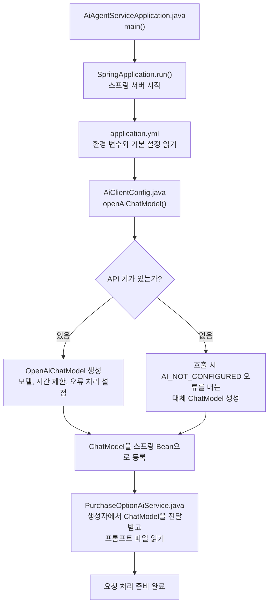
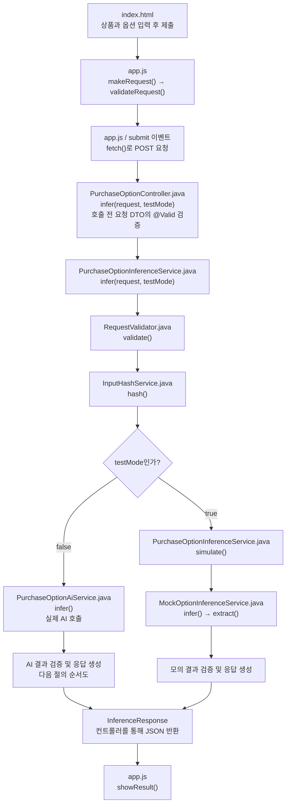
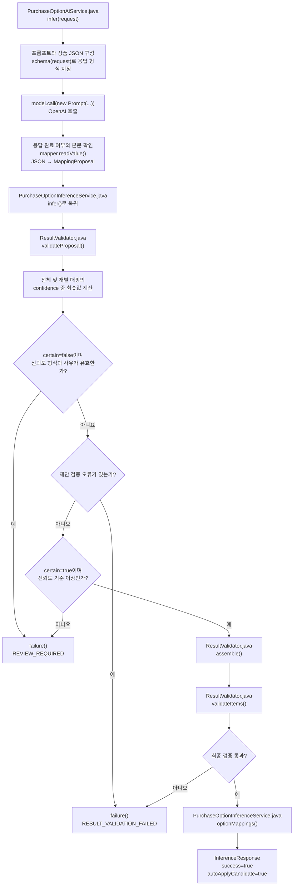
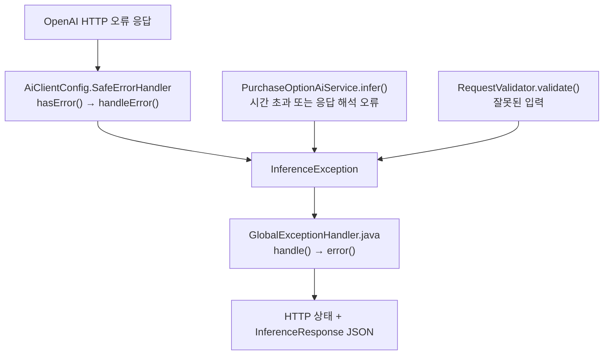

# AI Agent Service 프로젝트 설명

이 문서는 현재 소스 코드를 기준으로 기술 스택, API 사양, 실행 조건과 서버 시작·요청 처리·AI 호출·결과 검증의 순서를 설명합니다. 순서도의 상자에는 파일명과 메소드명을 함께 적었습니다. Mermaid를 지원하는 Markdown 뷰어에서 순서도를 그림으로 볼 수 있습니다.

## 1. 프로젝트가 하는 일

상품의 원본 단품 옵션명을 분석해서 쿠팡 구매옵션별 값을 추출하는 Spring Boot 서비스입니다.

```text
원본 옵션명: "블랙/90"
허용 구매옵션명: ["패션의류/잡화 사이즈", "색상"]
              ↓
구매옵션: {"패션의류/잡화 사이즈": "90", "색상": "블랙"}
```

AI는 매핑을 제안하고, 서버는 그 결과를 검증합니다. 검증과 신뢰도 기준을 통과하면 자동 적용 후보로 반환합니다. 현재 서비스는 상품이나 DB를 직접 수정하지 않습니다. `agent`, `tool` 패키지는 향후 확장을 위한 경계이며 현재 처리 흐름에는 참여하지 않습니다.

### 1.1 기술 스택

아래 사양은 2026-10-05 기준 저장소의 [pom.xml](../pom.xml), [application.yml](../src/main/resources/application.yml) 및 소스 코드에 설정된 값입니다.

| 구분 | 기술 / 버전 | 용도 |
|---|---|---|
| 프로젝트 | `com.cware.ai:ai-agent-service:0.1.0-SNAPSHOT` | Maven 프로젝트 및 실행 JAR |
| 언어 / 실행 환경 | Java 17 | Java record 기반 DTO, 서버 실행 |
| 서버 프레임워크 | Spring Boot `3.5.16` | 애플리케이션 설정, 의존성 주입, 내장 Tomcat |
| HTTP API | Spring Web MVC | JSON 요청·응답 및 정적 테스트 페이지 제공 |
| AI 연동 | Spring AI `1.1.8`, `spring-ai-openai` | `OpenAiChatModel`을 통한 동기 AI 호출 |
| 기본 AI 모델 | `gpt-4.1-mini` | `OPENAI_MODEL`로 변경 가능 |
| 데이터 검증 | Jakarta Bean Validation, Spring Validation | 필수 필드, 문자열 길이, 목록 크기 검사 |
| JSON 처리 | Jackson | DTO 직렬화·역직렬화 및 AI 응답 해석 |
| 웹 화면 | HTML, CSS, JavaScript | 프레임워크 없이 입력 폼, Fetch API, 결과 표 구현 |
| 빌드 | Maven, Spring Boot Maven Plugin | 테스트, 실행 JAR 패키징 |
| 테스트 | Spring Boot Test, JUnit 5, AssertJ, Mockito, MockMvc | API·추론·검증·오류 처리 테스트 |
| 컨테이너 | Docker 다단계 빌드, Docker Compose | Maven / Temurin 17 빌드, Temurin 17 JRE 실행 |

### 1.2 기능 범위와 구성

한 요청에 상품 하나와 최대 200개 단품을 받아, 단품별 쿠팡 구매옵션명과 값을 매핑합니다. 웹 테스트 화면과 API는 같은 Spring Boot 서버에서 제공합니다. 실제 AI 경로는 요청을 받는 동안 AI 응답을 기다리는 동기 처리 방식입니다.

SK스토아 상품정보고시는 `productNoticeText`라는 긴 텍스트로 입력받습니다. 실제 AI가 원본 옵션명의 의미를 판단하는 보조 자료이며, 정보고시를 별도의 쿠팡 고시 항목으로 변환하는 기능은 없습니다. 상품정보와 허용 구매옵션명은 호출자가 전달하며, SK스토아나 쿠팡에서 자동 조회하지 않습니다.

데이터베이스, 결과 저장, 캐시 저장·조회, 메시지 큐, 배치 작업은 구현되어 있지 않습니다. 추론 결과는 HTTP 응답으로 반환하며, 상품 등록·수정과 자동 적용은 호출 측에서 결정합니다.

### 1.3 API 요청 사양

| 항목 | 사양 |
|---|---|
| 웹 테스트 화면 | `GET /` |
| 추론 API | `POST /api/v1/coupang/purchase-options/infer` |
| 요청 / 응답 형식 | JSON, 요청 `Content-Type: application/json` |
| 처리 모드 | 쿼리 매개변수 `testMode`, 기본 `false`; `true`이면 API 키 없이 모의 추출 |
| 기본 로컬 주소 | `http://127.0.0.1:8081` |

필드 정의의 기준은 [InferenceRequest.java](../src/main/java/com/cware/ai/dto/InferenceRequest.java)와 [SourceOption.java](../src/main/java/com/cware/ai/dto/SourceOption.java)입니다. 문자열 제한은 Java 문자열 길이 기준입니다.

| 요청 필드 | 타입 | 필수 | 제한 / 의미 |
|---|---|---|---|
| `goodsId` | 문자열 | 예 | 상품 코드, 최대 100자 |
| `goodsName` | 문자열 | 예 | 상품명, 최대 500자 |
| `brand` | 문자열 | 아니요 | 브랜드, 최대 200자 |
| `categoryName` | 문자열 | 예 | 내부 / SK스토아 카테고리, 최대 500자 |
| `coupangCategoryId` | 문자열 | 예 | 쿠팡 카테고리 키, 최대 100자 |
| `coupangCategoryName` | 문자열 | 예 | 쿠팡 카테고리명, 최대 500자 |
| `allowedPurchaseOptions` | 문자열 배열 | 예 | 1~20개, 각 이름 최대 100자, 중복 불가 |
| `options` | 객체 배열 | 예 | 1~200개 단품, null 단품 불가 |
| `options[].optionId` | 문자열 | 예 | 최대 100자, 요청 내 중복 불가 |
| `options[].optionName1` | 문자열 | 예 | 분리하지 않은 원본 옵션명, 최대 500자 |
| `productNoticeText` | 문자열 | 아니요 | SK스토아 정보고시 항목명과 값을 이어 붙인 텍스트, 최대 20,000자 |

필수 문자열과 옵션명 배열의 각 이름은 빈 문자열이나 공백만 있는 값을 허용하지 않습니다. 정의되지 않은 JSON 필드는 거부합니다. 허용 구매옵션명을 모두 채울 필요는 없지만, 각 단품에는 최소 하나의 유효한 매핑이 필요합니다.

기본 테스트 상품은 `68535109`, **아이그너 레터링 자카드 니트탑**입니다. 단품은 `블랙/90`, `블랙/95`, `블랙/100`, `블랙/105` 네 개이며, 허용 구매옵션명은 `패션의류/잡화 사이즈`, `색상`입니다. 예제의 단품 ID `1`~`4`는 테스트용입니다. 전체 요청과 정보고시 9개 항목은 [ai-request.json](../examples/ai-request.json)에서 확인할 수 있습니다.

### 1.4 API 응답과 성공 기준

응답 정의는 [InferenceResponse.java](../src/main/java/com/cware/ai/dto/InferenceResponse.java)를 따릅니다.

| 응답 필드 | 의미 |
|---|---|
| `goodsId` | 처리한 상품 코드. 요청 처리 전 예외 응답에서는 null일 수 있음 |
| `success` | 실제 AI 추론 결과가 성공 기준을 통과했는지 여부 |
| `autoApplyCandidate` | 호출 측에서 자동 적용을 고려할 수 있는 후보인지 여부 |
| `confidence` | 전체 및 개별 매핑 신뢰도의 최솟값, 0~1 |
| `optionMappings` | 단품 ID, 원본 옵션명, 대상 구매옵션명, 추출 값, 개별 신뢰도 및 수량 근거 `evidenceSource`, `evidenceText` |
| `items` | 단품 ID와 `purchaseOptions` 이름·값 Map으로 구성한 결과 |
| `reason` | 판단 또는 오류 사유 |
| `validationErrors` | 누락·중복·허용 범위 위반 등 검증 오류 목록 |
| `errorCode` | 오류 / 검토 / 테스트 코드, 성공 시 null |
| `inputHash` | 입력 식별용 SHA-256 해시, 정상 처리 경로에서 64자리 16진수 |
| `promptVersion` | 프롬프트 버전 표식, 현재 `coupang-option-v12` |
| `inferenceSource` | 실제 추론 `AI`, 모의 추론 `TEST`, 예외 응답 `NONE` |

실제 AI 결과는 `certain=true`, 최종 신뢰도 `0.80` 이상, 제안 검증 및 단품 결과 검증 통과 조건을 모두 만족해야 성공합니다. 호출 측에서는 HTTP 200 여부만 확인하지 않고 `success`와 `autoApplyCandidate`가 모두 `true`인지 확인해야 합니다.

값의 의미와 수량·근거의 타당성은 AI가 판단합니다. 서버는 값의 원문 포함 여부를 검사하지 않습니다. 단품 매핑 누락, 허용 이름 위반, 서로 다른 단품의 동일한 최종 구매옵션 조합은 검증 실패입니다. 실패 응답의 매핑·단품 결과 목록은 비워 반환합니다.

테스트 모드는 공백과 `/`를 구분자로 색상 단어, 숫자 사이즈, 핏 등의 기본 패턴을 모의 추출합니다. 단일상품의 명시된 수량 패턴도 모의 추출하지만 AI처럼 의미를 해석하지는 않습니다. 검증을 통과해도 `success=false`, `autoApplyCandidate=false`, `confidence=0`, `errorCode=TEST_MODE`입니다.

수량·용량·중량의 `calculation`은 AI의 판단 설명 구조입니다. [Calculation.java](../src/main/java/com/cware/ai/dto/Calculation.java)는 응답 계약이며 서버 승인 경로는 원문 대조나 재계산을 수행하지 않습니다. 아래 연산 표는 기존 계산 유틸리티의 동작이며 승인 조건이 아닙니다.

| 연산 | 피연산자 | 검사·계산 |
|---|---|---|
| DIRECT | 1개 | 원문 숫자·단위의 직접 추출 및 표기 정리 |
| CONVERT | 1개 | 같은 차원의 g/kg/mg, ml/L 환산 |
| SUM | 2~20개 | + 또는 구성 범위의 모든 같은 차원 수치를 한 번씩 합산 |
| PACK_COUNT | 0 또는 1개 | 명확한 구성의 1묶음, 또는 원문에 명시된 판매 묶음 수 |
| PACK_CONTENT | 1개 | 포장 기준 근거와 포장 내 숫자를 확인 |

피연산자는 `amount`, `unit`, `evidence={source,text}`를 가집니다. `context`는 AI가 선택한 구성 근거입니다. 서버는 값, 출처, 근거와 계산 구조를 그대로 반환하며 숫자·단위 대조, 출처 보정과 표준화는 수행하지 않습니다.

합산·포장 구성·단위·사은품의 의미 판단은 AI가 담당합니다. `CalculationValidator.evaluate()`는 기존 계산 유틸리티와 직접 단위 테스트에 남아 있으며 `ResultValidator`와 `PurchaseOptionInferenceService`에서는 호출하지 않습니다. 단위 목록과 모의 계산 구조 생성에는 기존 유틸리티를 사용합니다.

`calculation=null`인 제안도 기본 구조 검사만 수행합니다. 모의 추출기는 기존 패턴으로 값을 찾고 `MockCalculation`으로 설명 구조를 만듭니다. 실제 AI와 모의 추출 모두 서버의 원문·계산 재검증은 거치지 않습니다.

[김치 AI 제안 구조 예제](../examples/structured-proposal.json)는 새 calculation 계약의 전체 응답 예시입니다. [OpenAI 공식 구조화 출력 문서](https://developers.openai.com/api/docs/guides/structured-outputs)에 따라 모든 객체 필드를 required로 지정하고 additionalProperties=false, 선택 필드는 nullable로 정의합니다.

### 1.5 실행 및 AI 연동 사양

| 항목 | 현재 설정 |
|---|---|
| 서버 포트 / 주소 | `PORT=8081`, `SERVER_ADDRESS=127.0.0.1` 기본값 |
| API 인증 키 | 실제 추론에 `OPENAI_API_KEY` 필요, 키 없이 서버 시작·테스트 모드 가능 |
| AI 호출 | 요청당 한 번의 동기 호출, 자동 재시도 없음 |
| AI 출력 설정 | `temperature=0`, `max-tokens=4096` |
| 연결 / 응답 읽기 시간 제한 | 연결 `5s`, 읽기 `30s`; 전체 작업 시간 보장값은 아님 |
| AI 응답 형식 | 엄격한 JSON Schema, 요청의 단품 ID·허용 옵션명으로 `enum` 제한 |
| AI 응답 본문 제한 | 최대 65,536자, 종료 사유 `stop` 필요 |
| AI 판단 사유 제한 | 한국어 1~3문장으로 지시, 서버는 비어 있지 않은 최대 2,000자 문자열인지 검증 |
| 입력 식별 | 해시 버전 `input-v4`, 상품·브랜드·카테고리·정보고시·옵션 목록 포함 |

로컬 실행은 Java 17과 Maven을 사용합니다. 별도 Tomcat 설치는 필요하지 않습니다. `mvn test`로 테스트하고 `mvn package` 또는 `mvn verify`로 실행 JAR을 생성합니다. 실행 파일은 `target/ai-agent-service-0.1.0-SNAPSHOT.jar`입니다.

[Dockerfile](../Dockerfile)과 [Dockerfile.vercel](../Dockerfile.vercel)은 Maven / Temurin 17 빌드 이미지와 Temurin 17 JRE 실행 이미지를 사용합니다. 컨테이너 내부 주소는 `0.0.0.0:8081`이며 일반 사용자 UID `10001`로 실행합니다. Compose의 호스트 주소·포트는 `HOST_ADDRESS`, `HOST_PORT`로 설정하며 기본은 `127.0.0.1:8081`입니다. 빌드 단계에는 `pom.xml`, `src/`와 API 테스트에 필요한 `examples/`를 복사합니다. 실행 이미지에는 패키징한 JAR을 복사합니다.

### 1.6 운영 조건과 검증 범위

현재 애플리케이션에는 사용자 로그인, 호출자 인증, 호출 횟수 제한 기능이 없습니다. 외부 공개 시 접근 제어는 배포 환경 또는 추가 구현으로 마련해야 합니다. 실제 AI 호출에서는 상품·단품·정보고시가 OpenAI API로 전송됩니다. 애플리케이션의 외부 오류 처리기는 API 키나 외부 응답 본문을 클라이언트에 노출하지 않도록 오류를 요약합니다.

AI 통신에는 `api.openai.com:443`에 대한 HTTPS 접근과 서버 JVM이 신뢰하는 인증서 체인이 필요합니다. 회사 VPN / 보안 프록시가 회사 인증서를 제공하면 해당 인증서에 대한 JVM 신뢰 설정이 필요할 수 있습니다. `PKIX path building failed`는 인증서 신뢰 문제를 확인할 단서이며, 현재 API에서는 상세 원인 대신 `AI_UPSTREAM_ERROR`로 반환될 수 있습니다.

테스트는 입력 검증, 모의 추출, AI 요청·응답 형식, 신뢰도와 결과 검증, 입력 해시, API 오류 처리, API 키 없는 서버 시작을 확인합니다. AI 응답은 모의 객체 또는 테스트 HTTP 서버로 검증하며, 실제 모델의 추출 정확도를 보장하는 평가 결과는 아닙니다. 현재 처리량, 동시 접속 한도, 평균 응답 시간, 정확도에 대한 부하·품질 측정값은 정의되어 있지 않습니다. 단품 200개라는 입력 상한도 AI 출력 4,096토큰 내 완료를 보장하지 않습니다.

## 2. 핵심 파일과 역할

Java 파일의 기준 경로는 `src/main/java/com/cware/ai/`입니다.

| 파일 | 주요 메소드 | 역할 |
|---|---|---|
| [AiAgentServiceApplication.java](../src/main/java/com/cware/ai/AiAgentServiceApplication.java) | `main()` | 스프링 서버 시작 |
| [config/AiClientConfig.java](../src/main/java/com/cware/ai/config/AiClientConfig.java) | `openAiChatModel()` | AI 호출 객체 생성 및 등록 |
| [config/InferenceProperties.java](../src/main/java/com/cware/ai/config/InferenceProperties.java) | 생성자 및 record 접근자 | 신뢰도 기준, 프롬프트 버전, 시간 제한 설정 보관 |
| [controller/PurchaseOptionController.java](../src/main/java/com/cware/ai/controller/PurchaseOptionController.java) | `infer()` | HTTP 요청을 받아 서비스 호출 |
| [service/PurchaseOptionInferenceService.java](../src/main/java/com/cware/ai/service/PurchaseOptionInferenceService.java) | `infer()`, `simulate()`, `failure()` | 전체 처리 순서 조율 및 응답 생성 |
| [inference/RequestValidator.java](../src/main/java/com/cware/ai/inference/RequestValidator.java) | `validate()` | 입력의 중복과 옵션 관계 검사 |
| [util/InputHashService.java](../src/main/java/com/cware/ai/util/InputHashService.java) | `hash()` | 입력 식별용 SHA-256 해시 생성 |
| [inference/OptionInferenceGateway.java](../src/main/java/com/cware/ai/inference/OptionInferenceGateway.java) | `infer()` | 추론 기능을 호출하는 인터페이스 |
| [inference/PurchaseOptionAiService.java](../src/main/java/com/cware/ai/inference/PurchaseOptionAiService.java) | `infer()`, `schema()` | 프롬프트 구성, AI 호출, 응답 JSON 해석 |
| [inference/MockOptionInferenceService.java](../src/main/java/com/cware/ai/inference/MockOptionInferenceService.java) | `infer()`, `extract()` | 테스트 모드에서 규칙으로 모의 추출 |
| [inference/ResultValidator.java](../src/main/java/com/cware/ai/inference/ResultValidator.java) | `validateProposal()`, `assemble()`, `validateItems()` | 제안 검증, 단품 결과 조립, 최종 검증 |
| [exception/GlobalExceptionHandler.java](../src/main/java/com/cware/ai/exception/GlobalExceptionHandler.java) | `handle()`, `invalid()`, `malformed()` 등 | 예외를 HTTP 상태와 JSON 응답으로 변환 |
| [static/app.js](../src/main/resources/static/app.js) | `makeRequest()`, `validateRequest()`, `showResult()` | 웹 화면의 입력 수집과 결과 표시 |

## 3. 서버 시작 순서

아래는 핵심 의존성을 중심으로 정리한 흐름입니다. 모든 스프링 Bean의 생성 순서를 나열한 것은 아닙니다.



**Bean**은 스프링이 생성하고 보관하여 필요한 클래스에 전달하는 객체입니다. **의존성 주입**은 필요한 객체를 생성자 등으로 전달받는 것을 말합니다.

`AiClientConfig.openAiChatModel()`은 AI 호출 객체를 준비합니다. 이 메소드에서 상품 데이터를 보내지는 않습니다. 실제 호출은 요청 처리 중 `PurchaseOptionAiService.infer()`의 `model.call(...)`에서 발생합니다.

API 키가 없어도 대체 `ChatModel`이 등록되므로 서버를 시작하고 테스트 모드를 사용할 수 있습니다. 실제 AI 호출 시에는 `AI_NOT_CONFIGURED`와 HTTP 503이 반환됩니다.

### AiClientConfig의 설정

설정값의 출처는 [application.yml](../src/main/resources/application.yml)입니다.

| 코드 또는 설정 | 기본값 | 의미 |
|---|---|---|
| `apiKey` | 빈 문자열 | `OPENAI_API_KEY` 환경 변수에서 인증 키 읽기 |
| `model` | `gpt-4.1-mini` | `OPENAI_MODEL` 환경 변수로 변경 가능 |
| `temperature` | `0` | 답변의 변동성 설정 |
| `maxTokens` | `4096` | 출력 토큰 수 제한 |
| `factory.setConnectTimeout()` | `5s` | 연결 대기 시간 제한 |
| `factory.setReadTimeout()` | `30s` | 응답 읽기 대기 시간 제한 |
| `responseErrorHandler(new SafeErrorHandler())` | 사용자 정의 처리기 | 외부 HTTP 오류를 프로젝트 오류로 변환 |
| `RetryTemplate.builder().maxAttempts(1)` | 1회 시도 | 자동 재시도 없음 |
| `confidence-threshold` | `0.80` | 실제 AI 결과의 성공 판단 기준 |
| `prompt-version` | `coupang-option-v12` | 응답에 포함할 프롬프트 버전 표식 |

## 4. 웹 요청 처리 순서



요청 주소:

```text
실제 AI: POST /api/v1/coupang/purchase-options/infer
테스트:  POST /api/v1/coupang/purchase-options/infer?testMode=true
```

입력 검증은 여러 단계에 걸쳐 수행합니다.

1. `app.js.validateRequest()`가 화면에서 기본 입력 조건을 확인합니다.
2. `InferenceRequest`와 `SourceOption`의 검증 어노테이션이 필수 필드, 길이, 목록 크기 등을 확인합니다.
3. `RequestValidator.validate()`가 허용 옵션명 중복, 단품 ID 중복 등을 확인합니다.

`InputHashService.hash()`는 상품정보고시를 포함한 상품 정보와 단품 정보를 바탕으로 SHA-256 해시를 생성합니다. 허용 옵션명과 단품 목록은 순서를 정렬하여 반영합니다. 현재 흐름에서는 이 값을 응답의 `inputHash`에 담으며, 해시를 이용해 캐시를 조회하거나 저장하는 코드는 없습니다.

서비스의 `ai` 필드는 `OptionInferenceGateway` 타입입니다. 현재 구현 Bean인 `PurchaseOptionAiService`가 주입되므로 `ai.infer(request)`는 그 클래스의 `infer()`를 실행합니다. 테스트 모드는 별도 분기로 `MockOptionInferenceService.infer()`를 직접 호출합니다.

## 5. 실제 AI 호출과 결과 처리



### AI에 보내는 정보

- [coupang-purchase-option-system.txt](../src/main/resources/prompts/coupang-purchase-option-system.txt): 원본에 없는 값을 생성하지 않는 등의 분석 규칙입니다.
- [coupang-purchase-option-user.txt](../src/main/resources/prompts/coupang-purchase-option-user.txt): 작업 안내입니다. 뒤에 상품 JSON을 붙입니다.
- `schema(request)`: 응답 필드와 타입을 지정합니다. 단품 ID와 구매옵션명은 요청에서 허용한 값만 선택하도록 `enum`으로 제한합니다.

AI의 응답은 `MappingProposal` 객체로 변환합니다. 응답이 비어 있거나 JSON 형식이 잘못되면 `AI_INVALID_JSON`, 종료 사유가 `stop`이 아니면 `AI_INCOMPLETE_RESPONSE`로 처리합니다.

### 신뢰도와 실패 판단

최종 `confidence`는 전체 신뢰도와 유효한 개별 매핑 신뢰도 중 최솟값입니다. 예를 들어 전체가 `0.99`, 개별 매핑 중 하나가 `0.90`이면 최종값은 `0.90`입니다. 기본 기준 `0.80` 이상이므로 `certain=true`이고 모든 검증을 통과하면 성공합니다. 개별 매핑 하나라도 `0.80` 미만이면 검토 대상으로 반환합니다. 신뢰도는 AI의 추정값이며 검증된 정답 확률을 의미하지 않습니다.

`certain=false`이고 전체 신뢰도 형식과 사유가 유효하면, 제안 검증 오류가 있어도 `REVIEW_REQUIRED`를 우선 반환하고 해당 오류를 `validationErrors`에 담습니다. 그 밖의 제안 검증 오류는 `RESULT_VALIDATION_FAILED`로 반환합니다.

`failure()`는 `success=false`, `autoApplyCandidate=false`로 응답하고 `optionMappings`, `items`를 빈 목록으로 만듭니다.

### AI 제안과 서버 판정 구분

세트 예제는 PACK_COUNT와 PACK_CONTENT로 판매 묶음 수와 내용물 개수를 구분합니다. [칫솔 요청 예제](../examples/set-request.json)는 두 허용 이름을 모두 포함하며, 수량만 허용하면 개당 수량을 반환하지 않습니다. 기존 NamedSetContext는 이전 형식 호환과 모의 추출 패턴에만 사용합니다.

응답의 `aiAssessment`에는 AI가 반환한 `certain`, 전체 `confidence`, `reason`, 제안 `mappings`(값·개별 신뢰도·근거·calculation)가 들어갑니다. 반려된 제안도 이 필드에 보존하며 서버가 승인한 결과와 구분합니다. 서버가 거부한 값은 `optionMappings`와 `items`에 넣지 않습니다. 테스트 모드, 통신 실패, AI 응답 파싱 실패처럼 확인 가능한 AI 제안이 없으면 `aiAssessment=null`입니다. 이 필드는 파싱된 최종 AI 응답이며 내부 사고 과정이나 HTTP 원문을 의미하지 않습니다.

`serverAssessment`는 서버의 `decisionCode`, 판정 `reason`, 실제 `confidenceThreshold`를 제공합니다. `ACCEPTED`는 승인, `LOW_CONFIDENCE`는 전체·개별 매핑 중 최저 신뢰도 미달, `AI_UNCERTAIN`은 AI의 `certain=false`, `RESULT_VALIDATION_FAILED`는 서버 검증 실패, `TEST_MODE`는 모의 결과입니다. 요청·통신 오류는 해당 오류 코드를 사용합니다. 자세한 검증 오류는 기존 `validationErrors`에 있습니다. 여러 조건이 실패할 수 있으므로 AI 불확실 판정과 검증 오류를 함께 확인해야 합니다.

기존 `reason`과 `errorCode`는 호환성을 위해 유지합니다. 테스트 페이지는 **서버 판정**과 **AI 판단 · 서버 승인 전 제안**을 따로 표시하며, 자동 적용 판단은 계속 `success`와 `autoApplyCandidate`를 사용합니다.

## 6. ResultValidator.java 상세 설명

이 클래스는 결과를 검사하고 조립합니다. 성공 여부와 신뢰도 기준에 따른 최종 판단은 `PurchaseOptionInferenceService`가 담당합니다.

```text
MappingProposal: AI의 제안
       ↓ validateProposal()
제안 내용이 입력 조건에 맞는지 검사
       ↓ 서비스에서 certain·신뢰도 판단
       ↓ assemble()
List<PurchaseOptionItem>: 단품별 결과
       ↓ validateItems()
조립 결과의 누락·변경·중복 검사
```

### 6.1 validateProposal(request, proposal)

AI가 제안한 결과를 검사하여 오류 문자열 목록을 반환합니다. 오류가 없으면 빈 목록입니다. 이 메소드는 검증 실패 자체를 예외로 던지지 않습니다.

| 검사 대상 | 조건 |
|---|---|
| 제안 객체 | `proposal`이 있어야 함 |
| 판단 여부 | `certain`이 null이면 안 됨. false 자체는 검증 오류가 아님 |
| 전체 신뢰도 | null이 아니고 0~1 범위의 유한한 수여야 함 |
| 추론 사유 | 공백이 아니고 길이가 2000자 이하여야 함 |
| 매핑 목록 | `mappings`가 null이면 안 됨 |
| 매핑 필드 | 항목, 단품 ID, 구매옵션명이 null이면 안 되고 값은 공백이면 안 됨 |
| 단품 ID | 원본 요청에 존재해야 함 |
| 추출 값 | 공백이 아닌 문자열이어야 함. 의미·원문·근거·계산은 AI 판단 사용 |
| 구매옵션명 | `allowedPurchaseOptions`에 포함되어야 함 |
| 매핑 중복 | 같은 단품 ID와 구매옵션명 조합을 두 번 반환하면 안 됨 |
| 개별 신뢰도 | 각 매핑도 0~1 범위의 유한한 수여야 함 |
| 단품 매핑 누락 | 각 원본 단품에 최소 하나의 매핑이 있어야 함 |

값의 원문 포함 여부와 calculation의 원문·숫자·단위·연산 타당성은 서버에서 검사하지 않습니다. 서로 다른 구매옵션명에 같은 값이 있어도 이 이유만으로 거부하지 않습니다.

내부 자료구조:

- `sources`: 단품 ID로 원본 단품을 찾는 Map입니다.
- `seen`: 단품 ID와 구매옵션명의 조합 중복을 찾는 Set입니다.
- `targets`: 단품별 매핑된 구매옵션명 Set을 보관합니다.

끝에서 `distinct()`로 같은 오류 문구를 중복 제거합니다. 제안이 null이거나 매핑 목록이 null인 경우에는 해당 오류 목록을 즉시 반환합니다.

### 6.2 assemble(request, proposal)

검증된 매핑을 단품별 구매옵션 Map으로 묶습니다.

```text
제안 매핑:
  optionId=1, 패션의류/잡화 사이즈=90
  optionId=1, 색상=블랙
                ↓
단품 결과:
  optionId=1
  purchaseOptions={패션의류/잡화 사이즈=90, 색상=블랙}
```

1. `byId` Map에 단품 ID별 구매옵션을 모읍니다.
2. `request.options()`를 순회하여 원본 단품 순서대로 `PurchaseOptionItem`을 만듭니다.
3. 구매옵션 Map을 `Collections.unmodifiableMap()`으로 감싸 외부 수정을 막습니다.

서비스는 `validateProposal()`을 통과한 뒤 `assemble()`을 호출하고 AI의 `entry.value()`를 그대로 사용합니다. `optionMappings`에서도 AI의 값·근거·calculation을 변경하지 않습니다.

### 6.3 validateItems(request, proposal, items)

조립된 최종 결과를 다시 검사합니다. `assemble(request, proposal)`로 기준 결과를 재구성한 뒤 전달받은 `items`와 대조합니다.

| 검사 | 목적 |
|---|---|
| 단품 개수 | 원본과 결과의 개수가 같은지 확인 |
| 결과 또는 구매옵션 Map의 null | 단품 결과 누락 확인 |
| 단품 ID 중복 | 같은 단품이 두 번 등장하는지 확인 |
| 구매옵션 Map 비교 | 제안에서 조립한 기준 결과와 값·조합이 같은지 확인 |
| 허용 구매옵션명 | 허용 목록 밖의 이름이 있는지 확인 |
| 구매옵션 조합 중복 | 서로 다른 단품이 같은 최종 구매옵션 Map을 갖는지 확인 |
| 단품 ID 집합 | 원본 단품이 빠지거나 새 단품이 추가되었는지 확인 |

예를 들어 서로 다른 두 단품이 모두 `{색상=남색, 사이즈=100}`이면 조합 중복 오류가 납니다. `{색상=남색, 사이즈=100}`과 `{색상=남색, 사이즈=150}`은 서로 다른 조합입니다.

### 6.4 validConfidence(value)

```java
return value != null && Double.isFinite(value) && value >= 0 && value <= 1;
```

null, NaN, 무한대, 음수, 1보다 큰 값을 거부합니다. 이 메소드는 숫자의 형식과 범위를 확인합니다. `0.80` 기준 충족 여부는 서비스에서 별도로 판단합니다.

## 7. 테스트 모드

`testMode=true`이면 실제 AI 호출을 건너뛰고 `simulate()`를 실행합니다.

```text
simulate()
  → MockOptionInferenceService.infer()
  → extract(): 색상 단어, 숫자 사이즈, '핏'으로 끝나는 토큰 등 추출
  → ResultValidator.validateProposal()
  → ResultValidator.assemble()
  → ResultValidator.validateItems()
  → optionMappings()
  → 테스트 응답 반환
```

모의 결과 검증을 통과해도 실제 AI의 성공으로 표시하지 않습니다.

| 응답 필드 | 검증을 통과한 테스트 결과 |
|---|---|
| `inferenceSource` | `TEST` |
| `errorCode` | `TEST_MODE` |
| `success` | `false` |
| `autoApplyCandidate` | `false` |
| `confidence` | `0` |
| `optionMappings`, `items` | 모의 추출 결과 |

모의 추출 결과가 검증에 실패하면 `RESULT_VALIDATION_FAILED`와 빈 결과 목록을 반환합니다. 테스트 모드는 신뢰도 기준으로 성공을 판단하는 실제 AI 경로와 다릅니다.

## 8. 오류 처리



| 상황 | 오류 코드 | HTTP 상태 |
|---|---|---|
| 실제 AI 호출 시 API 키 없음 | `AI_NOT_CONFIGURED` | 503 |
| OpenAI HTTP 429 | `AI_RATE_LIMIT` | 429 |
| OpenAI HTTP 408·504 또는 감지된 시간 초과 | `AI_TIMEOUT` | 504 |
| 그 밖의 외부 호출 실패 | `AI_UPSTREAM_ERROR` | 502 |
| AI 응답 JSON 해석 실패 | `AI_INVALID_JSON` | 502 |
| AI 응답이 정상 완료되지 않음 | `AI_INCOMPLETE_RESPONSE` | 502 |
| 요청 조건 위반 | `INVALID_REQUEST` | 400 |
| 잘못된 요청 JSON | `INVALID_JSON` | 400 |
| 예상하지 못한 예외 | `INTERNAL_ERROR` | 500 |
| 결과 검증 실패 | `RESULT_VALIDATION_FAILED` | 200 |
| 불확실하거나 신뢰도 기준 미달 | `REVIEW_REQUIRED` | 200 |

결과 검증 실패와 검토 필요는 서비스가 정상적으로 반환한 판단 결과입니다. 따라서 HTTP 200이어도 `success=false`일 수 있습니다. 호출자는 HTTP 상태와 함께 응답의 `success`, `autoApplyCandidate`, `errorCode`를 확인해야 합니다.

`SafeErrorHandler`는 외부 오류 응답의 본문과 헤더를 오류 메시지에 포함하지 않습니다. `GlobalExceptionHandler`는 요청 DTO 검증, JSON 해석, 매개변수 타입 오류도 별도의 메소드로 처리합니다.

## 9. 요청과 응답 데이터의 역할

| 객체 | 의미 |
|---|---|
| `InferenceRequest` | 상품 정보·정보고시, 허용 구매옵션명, 원본 단품 목록 |
| `SourceOption` | 단품 ID인 `optionId`와 원본 문자열인 `optionName1` |
| `MappingProposal` | 추론 단계의 제안: 확실성, 신뢰도, 매핑 목록, 사유 |
| `MappingProposal.Entry` | 단품 하나의 구매옵션명과 추출 값, 신뢰도 |
| `PurchaseOptionItem` | 단품 ID와 구매옵션 Map으로 조립한 결과 |
| `OptionMapping` | 원본 옵션명을 함께 담아 화면에서 보여줄 상세 매핑 |
| `InferenceResponse` | 성공 여부, 자동 적용 후보 여부, 결과와 오류 정보 등을 담은 최종 응답 |

허용 구매옵션명을 모두 채울 필요는 없지만, 각 단품에는 최소 하나의 유효한 매핑이 필요합니다.

## 10. 코드를 읽는 추천 순서

1. `PurchaseOptionController.infer()`: 요청이 어디로 들어오는지 확인합니다.
2. `PurchaseOptionInferenceService.infer()`: 전체 순서와 분기를 확인합니다.
3. `RequestValidator.validate()`: AI 호출 전에 입력을 어떻게 검사하는지 확인합니다.
4. `PurchaseOptionAiService.infer()`: AI에 보내는 데이터와 응답 해석을 확인합니다.
5. `AiClientConfig.openAiChatModel()`: AI 호출 객체가 어떻게 준비되는지 확인합니다.
6. `ResultValidator.validateProposal()` → `assemble()` → `validateItems()`: 제안이 최종 결과가 되는 조건을 확인합니다.
7. `GlobalExceptionHandler`와 `app.js.showResult()`: 오류와 결과가 사용자에게 전달되는 방식을 확인합니다.

실행 방법과 API 요청 예제는 프로젝트 루트의 [README.md](../README.md)를 참고하세요.
