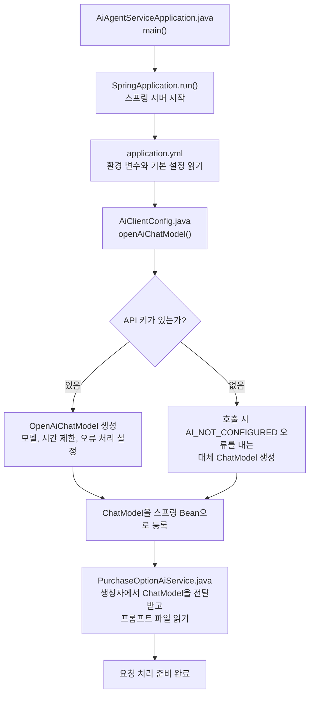
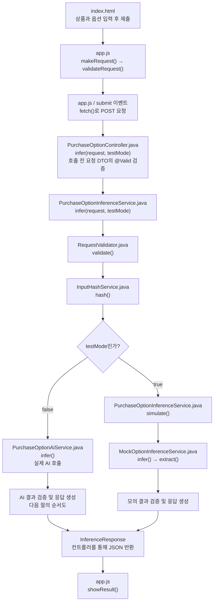
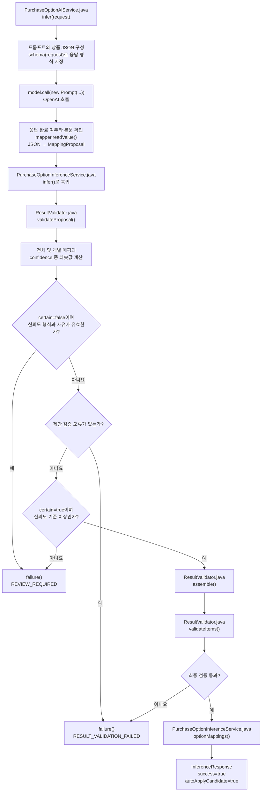
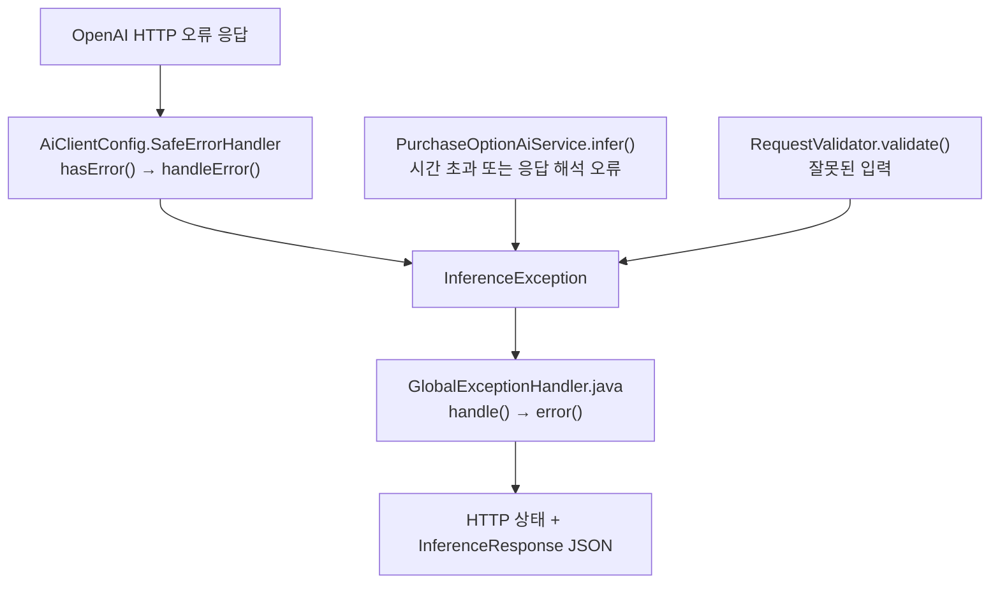

# AI Agent Service 프로젝트 설명

이 문서는 현재 소스 코드를 기준으로 서버 시작, 요청 처리, AI 호출, 결과 검증의 순서를 설명합니다. 순서도의 상자에는 파일명과 메소드명을 함께 적었습니다. Mermaid를 지원하는 Markdown 뷰어에서 순서도를 그림으로 볼 수 있습니다.

## 1. 프로젝트가 하는 일

상품의 원본 단품 옵션명을 분석해서 쿠팡 구매옵션별 값을 추출하는 Spring Boot 서비스입니다.

```text
원본 옵션명: "배기핏 남색 100"
허용 구매옵션명: ["핏", "색상", "사이즈"]
              ↓
구매옵션: {"핏": "배기핏", "색상": "남색", "사이즈": "100"}
```

AI는 매핑을 제안하고, 서버는 그 결과를 검증합니다. 검증과 신뢰도 기준을 통과하면 자동 적용 후보로 반환합니다. 현재 서비스는 상품이나 DB를 직접 수정하지 않습니다. `agent`, `tool` 패키지는 향후 확장을 위한 경계이며 현재 처리 흐름에는 참여하지 않습니다.

## 2. 핵심 파일과 역할

Java 파일의 기준 경로는 `src/main/java/com/cware/ai/`입니다.

| 파일 | 주요 메소드 | 역할 |
|---|---|---|
| [AiAgentServiceApplication.java](../src/main/java/com/cware/ai/AiAgentServiceApplication.java) | `main()` | 스프링 서버 시작 |
| [config/AiClientConfig.java](../src/main/java/com/cware/ai/config/AiClientConfig.java) | `openAiChatModel()` | AI 호출 객체 생성 및 등록 |
| [config/InferenceProperties.java](../src/main/java/com/cware/ai/config/InferenceProperties.java) | 생성자 및 record 접근자 | 신뢰도 기준, 프롬프트 버전, 시간 제한 설정 보관 |
| [controller/PurchaseOptionController.java](../src/main/java/com/cware/ai/controller/PurchaseOptionController.java) | `infer()` | HTTP 요청을 받아 서비스 호출 |
| [service/PurchaseOptionInferenceService.java](../src/main/java/com/cware/ai/service/PurchaseOptionInferenceService.java) | `infer()`, `simulate()`, `failure()` | 전체 처리 순서 조율 및 응답 생성 |
| [inference/RequestValidator.java](../src/main/java/com/cware/ai/inference/RequestValidator.java) | `validate()` | 입력의 중복과 옵션 관계 검사 |
| [util/InputHashService.java](../src/main/java/com/cware/ai/util/InputHashService.java) | `hash()` | 입력 식별용 SHA-256 해시 생성 |
| [inference/OptionInferenceGateway.java](../src/main/java/com/cware/ai/inference/OptionInferenceGateway.java) | `infer()` | 추론 기능을 호출하는 인터페이스 |
| [inference/PurchaseOptionAiService.java](../src/main/java/com/cware/ai/inference/PurchaseOptionAiService.java) | `infer()`, `schema()` | 프롬프트 구성, AI 호출, 응답 JSON 해석 |
| [inference/MockOptionInferenceService.java](../src/main/java/com/cware/ai/inference/MockOptionInferenceService.java) | `infer()`, `extract()` | 테스트 모드에서 규칙으로 모의 추출 |
| [inference/ResultValidator.java](../src/main/java/com/cware/ai/inference/ResultValidator.java) | `validateProposal()`, `assemble()`, `validateItems()` | 제안 검증, 단품 결과 조립, 최종 검증 |
| [exception/GlobalExceptionHandler.java](../src/main/java/com/cware/ai/exception/GlobalExceptionHandler.java) | `handle()`, `invalid()`, `malformed()` 등 | 예외를 HTTP 상태와 JSON 응답으로 변환 |
| [static/app.js](../src/main/resources/static/app.js) | `makeRequest()`, `validateRequest()`, `showResult()` | 웹 화면의 입력 수집과 결과 표시 |

## 3. 서버 시작 순서

아래는 핵심 의존성을 중심으로 정리한 흐름입니다. 모든 스프링 Bean의 생성 순서를 나열한 것은 아닙니다.



**Bean**은 스프링이 생성하고 보관하여 필요한 클래스에 전달하는 객체입니다. **의존성 주입**은 필요한 객체를 생성자 등으로 전달받는 것을 말합니다.

`AiClientConfig.openAiChatModel()`은 AI 호출 객체를 준비합니다. 이 메소드에서 상품 데이터를 보내지는 않습니다. 실제 호출은 요청 처리 중 `PurchaseOptionAiService.infer()`의 `model.call(...)`에서 발생합니다.

API 키가 없어도 대체 `ChatModel`이 등록되므로 서버를 시작하고 테스트 모드를 사용할 수 있습니다. 실제 AI 호출 시에는 `AI_NOT_CONFIGURED`와 HTTP 503이 반환됩니다.

### AiClientConfig의 설정

설정값의 출처는 [application.yml](../src/main/resources/application.yml)입니다.

| 코드 또는 설정 | 기본값 | 의미 |
|---|---|---|
| `apiKey` | 빈 문자열 | `OPENAI_API_KEY` 환경 변수에서 인증 키 읽기 |
| `model` | `gpt-4.1-mini` | `OPENAI_MODEL` 환경 변수로 변경 가능 |
| `temperature` | `0` | 답변의 변동성 설정 |
| `maxTokens` | `4096` | 출력 토큰 수 제한 |
| `factory.setConnectTimeout()` | `5s` | 연결 대기 시간 제한 |
| `factory.setReadTimeout()` | `30s` | 응답 읽기 대기 시간 제한 |
| `responseErrorHandler(new SafeErrorHandler())` | 사용자 정의 처리기 | 외부 HTTP 오류를 프로젝트 오류로 변환 |
| `RetryTemplate.builder().maxAttempts(1)` | 1회 시도 | 자동 재시도 없음 |
| `confidence-threshold` | `0.95` | 실제 AI 결과의 성공 판단 기준 |
| `prompt-version` | `coupang-option-v3` | 응답에 포함할 프롬프트 버전 표식 |

## 4. 웹 요청 처리 순서



요청 주소:

```text
실제 AI: POST /api/v1/coupang/purchase-options/infer
테스트:  POST /api/v1/coupang/purchase-options/infer?testMode=true
```

입력 검증은 여러 단계에 걸쳐 수행합니다.

1. `app.js.validateRequest()`가 화면에서 기본 입력 조건을 확인합니다.
2. `InferenceRequest`와 `SourceOption`의 검증 어노테이션이 필수 필드, 길이, 목록 크기 등을 확인합니다.
3. `RequestValidator.validate()`가 허용 옵션명 중복, 필수 옵션의 허용 목록 포함 여부, 단품 ID 중복 등을 확인합니다.

`InputHashService.hash()`는 상품 정보와 단품 정보를 정렬하여 SHA-256 해시를 생성합니다. 현재 흐름에서는 이 값을 응답의 `inputHash`에 담으며, 해시를 이용해 캐시를 조회하거나 저장하는 코드는 없습니다.

서비스의 `ai` 필드는 `OptionInferenceGateway` 타입입니다. 현재 구현 Bean인 `PurchaseOptionAiService`가 주입되므로 `ai.infer(request)`는 그 클래스의 `infer()`를 실행합니다. 테스트 모드는 별도 분기로 `MockOptionInferenceService.infer()`를 직접 호출합니다.

## 5. 실제 AI 호출과 결과 처리



### AI에 보내는 정보

- [coupang-purchase-option-system.txt](../src/main/resources/prompts/coupang-purchase-option-system.txt): 원본에 없는 값을 생성하지 않는 등의 분석 규칙입니다.
- [coupang-purchase-option-user.txt](../src/main/resources/prompts/coupang-purchase-option-user.txt): 작업 안내입니다. 뒤에 상품 JSON을 붙입니다.
- `schema(request)`: 응답 필드와 타입을 지정합니다. 단품 ID와 구매옵션명은 요청에서 허용한 값만 선택하도록 `enum`으로 제한합니다.

AI의 응답은 `MappingProposal` 객체로 변환합니다. 응답이 비어 있거나 JSON 형식이 잘못되면 `AI_INVALID_JSON`, 종료 사유가 `stop`이 아니면 `AI_INCOMPLETE_RESPONSE`로 처리합니다.

### 신뢰도와 실패 판단

최종 `confidence`는 전체 신뢰도와 유효한 개별 매핑 신뢰도 중 최솟값입니다. 예를 들어 전체가 `0.99`, 개별 매핑 중 하나가 `0.90`이면 최종값은 `0.90`이므로 기본 기준 `0.95`에 미달합니다. 신뢰도는 AI의 추정값이며 검증된 정답 확률을 의미하지 않습니다.

`certain=false`이고 전체 신뢰도 형식과 사유가 유효하면, 제안 검증 오류가 있어도 `REVIEW_REQUIRED`를 우선 반환하고 해당 오류를 `validationErrors`에 담습니다. 그 밖의 제안 검증 오류는 `RESULT_VALIDATION_FAILED`로 반환합니다.

`failure()`는 `success=false`, `autoApplyCandidate=false`로 응답하고 `optionMappings`, `items`를 빈 목록으로 만듭니다.

## 6. ResultValidator.java 상세 설명

이 클래스는 결과를 검사하고 조립합니다. 성공 여부와 신뢰도 기준에 따른 최종 판단은 `PurchaseOptionInferenceService`가 담당합니다.

```text
MappingProposal: AI의 제안
       ↓ validateProposal()
제안 내용이 입력 조건에 맞는지 검사
       ↓ 서비스에서 certain·신뢰도 판단
       ↓ assemble()
List<PurchaseOptionItem>: 단품별 결과
       ↓ validateItems()
조립 결과의 누락·변경·중복 검사
```

### 6.1 validateProposal(request, proposal)

AI가 제안한 결과를 검사하여 오류 문자열 목록을 반환합니다. 오류가 없으면 빈 목록입니다. 이 메소드는 검증 실패 자체를 예외로 던지지 않습니다.

| 검사 대상 | 조건 |
|---|---|
| 제안 객체 | `proposal`이 있어야 함 |
| 판단 여부 | `certain`이 null이면 안 됨. false 자체는 검증 오류가 아님 |
| 전체 신뢰도 | null이 아니고 0~1 범위의 유한한 수여야 함 |
| 추론 사유 | 공백이 아니고 길이가 2000자 이하여야 함 |
| 매핑 목록 | `mappings`가 null이면 안 됨 |
| 매핑 필드 | 항목, 단품 ID, 구매옵션명이 null이면 안 되고 값은 공백이면 안 됨 |
| 단품 ID | 원본 요청에 존재해야 함 |
| 추출 값 | 해당 단품의 원본 옵션명에 부분 문자열로 존재해야 함 |
| 구매옵션명 | `allowedPurchaseOptions`에 포함되어야 함 |
| 매핑 중복 | 같은 단품 ID와 구매옵션명 조합을 두 번 반환하면 안 됨 |
| 값 중복 | 같은 단품에서 같은 추출 값을 여러 매핑에 사용하면 안 됨 |
| 개별 신뢰도 | 각 매핑도 0~1 범위의 유한한 수여야 함 |
| 단품 매핑 누락 | 각 원본 단품에 최소 하나의 매핑이 있어야 함 |
| 필수 옵션 | 각 단품에 `effectiveRequiredOptions()`의 모든 이름이 있어야 함 |

원본 값 검사는 `source.optionName1().contains(entry.value())`로 수행합니다. 원본이 `배기핏 남색 100`이면 `남색`은 통과하지만 `네이비`는 실패합니다. 이 검사는 부분 문자열의 존재를 확인하며, AI가 선택한 구매옵션의 의미까지 완전히 보장하지는 않습니다.

내부 자료구조:

- `sources`: 단품 ID로 원본 단품을 찾는 Map입니다.
- `seen`: 단품 ID와 구매옵션명의 조합 중복을 찾는 Set입니다.
- `targets`: 단품별 매핑된 구매옵션명 Set을 보관합니다.
- `values`: 단품별 사용된 추출 값 Set을 보관합니다.

끝에서 `distinct()`로 같은 오류 문구를 중복 제거합니다. 제안이 null이거나 매핑 목록이 null인 경우에는 해당 오류 목록을 즉시 반환합니다.

### 6.2 assemble(request, proposal)

검증된 매핑을 단품별 구매옵션 Map으로 묶습니다.

```text
제안 매핑:
  optionId=1, 핏=배기핏
  optionId=1, 색상=남색
  optionId=1, 사이즈=100
                ↓
단품 결과:
  optionId=1
  purchaseOptions={핏=배기핏, 색상=남색, 사이즈=100}
```

1. `byId` Map에 단품 ID별 구매옵션을 모읍니다.
2. `request.options()`를 순회하여 원본 단품 순서대로 `PurchaseOptionItem`을 만듭니다.
3. 구매옵션 Map을 `Collections.unmodifiableMap()`으로 감싸 외부 수정을 막습니다.

`assemble()` 자체는 제안을 검증하지 않습니다. 서비스는 `validateProposal()`을 통과한 뒤 호출합니다.

### 6.3 validateItems(request, proposal, items)

조립된 최종 결과를 다시 검사합니다. `assemble(request, proposal)`로 기준 결과를 재구성한 뒤 전달받은 `items`와 대조합니다.

| 검사 | 목적 |
|---|---|
| 단품 개수 | 원본과 결과의 개수가 같은지 확인 |
| 결과 또는 구매옵션 Map의 null | 단품 결과 누락 확인 |
| 단품 ID 중복 | 같은 단품이 두 번 등장하는지 확인 |
| 구매옵션 Map 비교 | 제안에서 조립한 기준 결과와 값·조합이 같은지 확인 |
| 허용 구매옵션명 | 허용 목록 밖의 이름이 있는지 확인 |
| 필수 구매옵션 | 각 단품의 필수 옵션 누락 확인 |
| 구매옵션 조합 중복 | 서로 다른 단품이 같은 최종 구매옵션 Map을 갖는지 확인 |
| 단품 ID 집합 | 원본 단품이 빠지거나 새 단품이 추가되었는지 확인 |

예를 들어 서로 다른 두 단품이 모두 `{색상=남색, 사이즈=100}`이면 조합 중복 오류가 납니다. `{색상=남색, 사이즈=100}`과 `{색상=남색, 사이즈=150}`은 서로 다른 조합입니다.

### 6.4 validConfidence(value)

```java
return value != null && Double.isFinite(value) && value >= 0 && value <= 1;
```

null, NaN, 무한대, 음수, 1보다 큰 값을 거부합니다. 이 메소드는 숫자의 형식과 범위를 확인합니다. `0.95` 기준 충족 여부는 서비스에서 별도로 판단합니다.

## 7. 테스트 모드

`testMode=true`이면 실제 AI 호출을 건너뛰고 `simulate()`를 실행합니다.

```text
simulate()
  → MockOptionInferenceService.infer()
  → extract(): 색상 단어, 숫자 사이즈, '핏'으로 끝나는 토큰 등 추출
  → ResultValidator.validateProposal()
  → ResultValidator.assemble()
  → ResultValidator.validateItems()
  → optionMappings()
  → 테스트 응답 반환
```

모의 결과 검증을 통과해도 실제 AI의 성공으로 표시하지 않습니다.

| 응답 필드 | 검증을 통과한 테스트 결과 |
|---|---|
| `inferenceSource` | `TEST` |
| `errorCode` | `TEST_MODE` |
| `success` | `false` |
| `autoApplyCandidate` | `false` |
| `confidence` | `0` |
| `optionMappings`, `items` | 모의 추출 결과 |

모의 추출 결과가 검증에 실패하면 `RESULT_VALIDATION_FAILED`와 빈 결과 목록을 반환합니다. 테스트 모드는 신뢰도 기준으로 성공을 판단하는 실제 AI 경로와 다릅니다.

## 8. 오류 처리



| 상황 | 오류 코드 | HTTP 상태 |
|---|---|---|
| 실제 AI 호출 시 API 키 없음 | `AI_NOT_CONFIGURED` | 503 |
| OpenAI HTTP 429 | `AI_RATE_LIMIT` | 429 |
| OpenAI HTTP 408·504 또는 감지된 시간 초과 | `AI_TIMEOUT` | 504 |
| 그 밖의 외부 호출 실패 | `AI_UPSTREAM_ERROR` | 502 |
| AI 응답 JSON 해석 실패 | `AI_INVALID_JSON` | 502 |
| AI 응답이 정상 완료되지 않음 | `AI_INCOMPLETE_RESPONSE` | 502 |
| 요청 조건 위반 | `INVALID_REQUEST` | 400 |
| 잘못된 요청 JSON | `INVALID_JSON` | 400 |
| 예상하지 못한 예외 | `INTERNAL_ERROR` | 500 |
| 결과 검증 실패 | `RESULT_VALIDATION_FAILED` | 200 |
| 불확실하거나 신뢰도 기준 미달 | `REVIEW_REQUIRED` | 200 |

결과 검증 실패와 검토 필요는 서비스가 정상적으로 반환한 판단 결과입니다. 따라서 HTTP 200이어도 `success=false`일 수 있습니다. 호출자는 HTTP 상태와 함께 응답의 `success`, `autoApplyCandidate`, `errorCode`를 확인해야 합니다.

`SafeErrorHandler`는 외부 오류 응답의 본문과 헤더를 오류 메시지에 포함하지 않습니다. `GlobalExceptionHandler`는 요청 DTO 검증, JSON 해석, 매개변수 타입 오류도 별도의 메소드로 처리합니다.

## 9. 요청과 응답 데이터의 역할

| 객체 | 의미 |
|---|---|
| `InferenceRequest` | 상품 정보, 허용·필수 구매옵션명, 원본 단품 목록 |
| `SourceOption` | 단품 ID인 `optionId`와 원본 문자열인 `optionName1` |
| `MappingProposal` | 추론 단계의 제안: 확실성, 신뢰도, 매핑 목록, 사유 |
| `MappingProposal.Entry` | 단품 하나의 구매옵션명과 추출 값, 신뢰도 |
| `PurchaseOptionItem` | 단품 ID와 구매옵션 Map으로 조립한 결과 |
| `OptionMapping` | 원본 옵션명을 함께 담아 화면에서 보여줄 상세 매핑 |
| `InferenceResponse` | 성공 여부, 자동 적용 후보 여부, 결과와 오류 정보 등을 담은 최종 응답 |

`requiredPurchaseOptions`를 생략하면 `effectiveRequiredOptions()`는 빈 목록을 반환합니다. 필수 목록이 비어 있어도 각 단품에는 최소 하나의 유효한 매핑이 필요합니다.

## 10. 코드를 읽는 추천 순서

1. `PurchaseOptionController.infer()`: 요청이 어디로 들어오는지 확인합니다.
2. `PurchaseOptionInferenceService.infer()`: 전체 순서와 분기를 확인합니다.
3. `RequestValidator.validate()`: AI 호출 전에 입력을 어떻게 검사하는지 확인합니다.
4. `PurchaseOptionAiService.infer()`: AI에 보내는 데이터와 응답 해석을 확인합니다.
5. `AiClientConfig.openAiChatModel()`: AI 호출 객체가 어떻게 준비되는지 확인합니다.
6. `ResultValidator.validateProposal()` → `assemble()` → `validateItems()`: 제안이 최종 결과가 되는 조건을 확인합니다.
7. `GlobalExceptionHandler`와 `app.js.showResult()`: 오류와 결과가 사용자에게 전달되는 방식을 확인합니다.

실행 방법과 API 요청 예제는 프로젝트 루트의 [README.md](../README.md)를 참고하세요.
